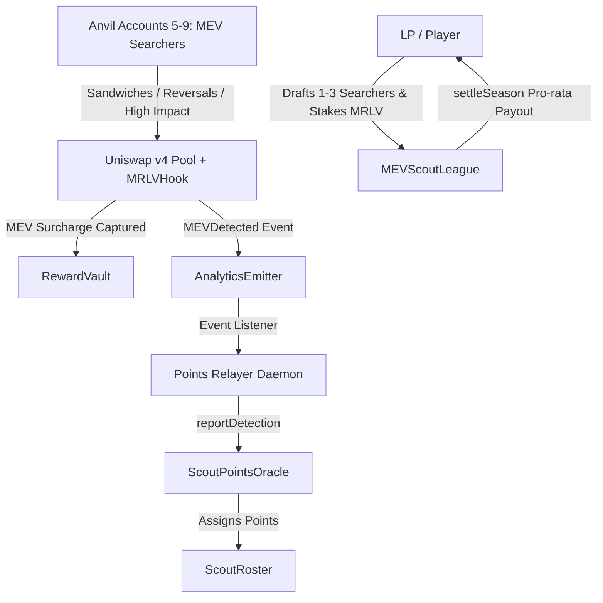

# Fantasy MEV League — Implementation & Architecture Report

## 1. Overview & Core Mechanics

The **Fantasy MEV League** is an isolated add-on game built atop the MEV-Redistributive Liquidity Vault (MRLV). Liquidity Providers (LPs) act as "MEV Scouts" by staking MRLV tokens to draft active on-chain searchers/bots into their season rosters (up to 3 picks).

When the Uniswap v4 Hook detects suspicious trades and applies dynamic fee surcharges, the detections are relayed to the `ScoutPointsOracle`, scoring points for the LPs who drafted those bots. At the end of the season, the accumulated prize pool (staked MRLV + protocol boosts) is distributed pro-rata to winning scouts based on their points scored.



---

## 2. Component Implementation Status

| Component | File / Location | Status | Key Capabilities |
|---|---|---|---|
| **League Orchestrator** | [MEVScoutLeague.sol](file:///c:/Users/Akshad/Desktop/v4-template/src/fantasy-league/MEVScoutLeague.sol) | 🟢 **Fully Operational** | Season state machine (`DRAFTING` $\rightarrow$ `ACTIVE` $\rightarrow$ `SETTLED`), MRLV staking escrow, prize pool boosts, pro-rata payouts, automated rollover. |
| **Scout Roster Registry** | [ScoutRoster.sol](file:///c:/Users/Akshad/Desktop/v4-template/src/fantasy-league/ScoutRoster.sol) | 🟢 **Fully Operational** | Enforces max 3 picks per LP, prevents duplicate trader drafts, persists points scored per pick and flagged status. |
| **Scoring Points Oracle** | [ScoutPointsOracle.sol](file:///c:/Users/Akshad/Desktop/v4-template/src/fantasy-league/ScoutPointsOracle.sol) | 🟢 **Fully Operational** | Configurable weights (`PRIORITY_FEE` = 25, `REVERSAL` = 30, `PRICE_IMPACT` = 20), updates season rosters and all-time scout score rankings. |
| **Multi-Searcher Simulation Script** | [SimulateMultiSearchers.s.sol](file:///c:/Users/Akshad/Desktop/v4-template/script/SimulateMultiSearchers.s.sol) | 🟢 **Fully Operational** | Foundry script executing sandwich attacks, reversals, and large price impacts from Anvil accounts #5 to #9. |
| **Points Relayer Daemon** | [relayer/index.js](file:///c:/Users/Akshad/Desktop/v4-template/src/fantasy-league/relayer/index.js) | 🟢 **Fully Operational** | Intercepts `MEVDetected` logs from `AnalyticsEmitter` and calls `ScoutPointsOracle.reportDetection(...)` with participant lists. |
| **Frontend Draft Board & UI** | [fantasy-league.tsx](file:///c:/Users/Akshad/Desktop/v4-template/frontend/src/routes/fantasy-league.tsx) | 🟢 **Fully Operational** | Live season stats, active searcher draft board (Accounts #5–#9), live MEV ticker, season leaderboard & standings, claim reward modal. |

---

## 3. Active Searcher Bot Registry (Anvil Accounts 5–9)

The following local searchers are funded and active on the Uniswap v4 pool, ready to be drafted in the Fantasy League:

| Bot Name | Archetype | Anvil Address | Attack / Trade Pattern |
|---|---|---|---|
| **Jared Sandwich Bot** | Sandwich Extractor | `0x9965507D1a55bcC2695C58ba16FB37d819B0A4dc` (Acc #5) | Frontrun + immediate reversal backrun (60 tokens, Score 50) |
| **Wintermute Fast Arb** | Arbitrageur | `0xC179fE958d6E80eA39968d2C5D6C7AE3AA02295C` (Acc #6) | Rapid opposite-direction reversal trades |
| **Flashbots Backrunner** | Backrun Specialist | `0x79F1126dFf473ccf886a3d19958E1f6306B6738d` (Acc #7) | Heavy single-flow trades (>80 tokens, large price impact) |
| **Atomic Liquidation Bot** | Liquidation Sniper | `0x4Cbf94708205d80438a778C9D472b25B316c8a93` (Acc #8) | High-volume sandwich attacks capturing liquidation margins |
| **Toxic Flow Sniper** | Cross-DEX Arbitrageur | `0xa0Ee7A142d267C1f36714E4a8F75612F20a79720` (Acc #9) | High-frequency toxic flow reversal trades |
| **Deployer Tester** | Primary Attacker | `0xf39Fd6e51aad88F6F4ce6aB8827279cffFb92266` (Acc #0) | Heavy simulation flows |

---

## 4. How to Play & Test End-to-End

### Step 1: Execute Suspicious Trades from Anvil Accounts 5–9
Run the new Foundry script:
```bash
forge script script/SimulateMultiSearchers.s.sol:SimulateMultiSearchers --rpc-url http://127.0.0.1:8545 --broadcast --private-key 0xac0974bec39a17e36ba4a6b4d238ff944bacb478cbed5efcae784d7bf4f2ff80
```
*Result*: Accounts 5 to 9 will automatically be funded with ETH and tokens, executing frontrun-backrun sandwiches and reversals against the pool.

### Step 2: Run the Points Relayer
Start the points relayer daemon in the background:
```bash
node src/fantasy-league/relayer/index.js
```
*Result*: Relayer will listen to `AnalyticsEmitter` for `MEVDetected` events and automatically credit fantasy points on-chain to any LPs who drafted those searchers.

### Step 3: Open the Fantasy League UI
Navigate to `http://localhost:5173/fantasy-league`:
1. Connect your LP wallet.
2. Select up to 3 active searchers from the **Draft Board** and click **Draft & Stake 50 MRLV**.
3. Use the **Admin Season Controls** to transition season phases:
   - **Open Drafting**: Allows players to pick searchers.
   - **Lock (Activate Scoring)**: Freezes rosters and begins round scoring.
   - **Settle Season Payouts**: Automatically computes final scores and credits proportional prize pool shares to winning LPs.
4. View your rank and estimated MRLV payout on the **Season Leaderboard**!
5. Claim your winnings with the **Claim MRLV Rewards** button!
