<div align="center">

# 🦄 MRLV
### MEV-Redistributive Liquidity Vault & Fantasy MEV League

**A Next-Generation Uniswap v4 Hook Architecture for MEV Capture, Dynamic Protection & Gamified Scouting**

[](https://github.com/uniswapfoundation/v4-core)
[](https://getfoundry.sh/)
[](https://soliditylang.org/)
[](https://vitejs.dev/)
[](LICENSE)

<br/>

[](https://github.com/akshadgujarkar/v4-template)
[](https://github.com/akshadgujarkar/v4-template)
[](https://github.com/akshadgujarkar/v4-template/issues)
[](CONTRIBUTING.md)

</div>

<br/>

## 🤝 Partner Integrations

**No partner integrations.** This project is built entirely from scratch using Uniswap v4 and standard open-source libraries.

---

## 🎥 Demo & Presentation

| Resource | Link |
|---|---|
| 📹 **Demo Video** | [Watch on YouTube](https://youtu.be/yWpKEfUPdkY?si=rqw1jjLkapFEScPo) |
| 📊 **Presentation Slides** | [View on Google Slides](https://docs.google.com/presentation/d/1bpO4T4m5UYHg6QhZ2-CzU0u_feSKwjEb/edit?usp=sharing&ouid=103469052666671778887&rtpof=true&sd=true) |

---

## 💡 Why MRLV? — Original Idea

> **MRLV doesn't just detect MEV — it captures the value and gives it back to the LPs who were being exploited.**

Most MEV projects either **block** toxic flow or simply **report** it. MRLV is fundamentally different:

| What's Novel | How It Works | Where in Code |
|---|---|---|
| 🔁 **MEV Redistribution** (not just detection) | Every swap is scored 0–100 in `beforeSwap`. Toxic flow pays a dynamic fee surcharge. The surplus is routed to a `RewardVault` that distributes to honest, long-term LPs. | [`MRLVHook.sol`](src/MRLVHook.sol) → [`MEVDetector.sol`](src/MEVDetector.sol) → [`RewardVault.sol`](src/RewardVault.sol) |
| 🎮 **Fantasy MEV League** | LPs draft known MEV searcher addresses, stake MRLV tokens, and earn prize pool shares when their picks get flagged on-chain. No existing hook or DeFi project does this. | [`MEVScoutLeague.sol`](src/fantasy-league/MEVScoutLeague.sol), [`ScoutRoster.sol`](src/fantasy-league/ScoutRoster.sol), [`ScoutPointsOracle.sol`](src/fantasy-league/ScoutPointsOracle.sol) |
| 🔒 **Liquidity Escrow Anti-JIT** | All liquidity additions go through a pending escrow with configurable maturity blocks. Direct `addLiquidity` calls are rejected — only matured positions activate. | [`MRLVHook.sol` → `depositPendingLiquidity()`](src/MRLVHook.sol) |
| 🎖️ **Soulbound Loyalty NFTs** | Non-transferable ERC-721 badges (🥉 Bronze → 🥈 Silver → 🥇 Gold) auto-upgrade based on LP tenure and boost reward multipliers (1x → 2x → 3x). | [`LoyaltyNFT.sol`](src/LoyaltyNFT.sol), [`LoyaltyManager.sol`](src/LoyaltyManager.sol) |

---

## ⚡ What We Built — Unique Execution

**10 production-grade smart contracts + off-chain relayer + full-stack frontend**, not a minimal prototype.

| Layer | Components | Key Technical Detail |
|---|---|---|
| 🪝 **v4 Hook Engine** | `MRLVHook.sol` (704 lines) | Uses `LPFeeLibrary.OVERRIDE_FEE_FLAG` for per-swap dynamic fee overrides via `beforeSwap` / `afterSwap` |
| 🔍 **Detection Engine** | `MEVDetector.sol` (197 lines) | 4 independent on-chain heuristics: priority fee anomaly, direction reversal, price impact sizing, JIT maturity |
| 📈 **Fee Scaling** | `DynamicFeeManager.sol` (110 lines) | Non-linear fee curve (0.30% → 3.00%) with per-block rate limiting (≤3x jump cap) and hard ceiling |
| 💰 **Reward System** | `RewardVault.sol` + `LoyaltyManager.sol` + `LoyaltyNFT.sol` + `MRLVToken.sol` | Epoch-based distribution weighted by normalized LP scores (amount × duration × contribution × consistency), soulbound NFTs, veMRLV-style governance locks, insurance pool (5% BPS), 50% early exit penalty |
| 🎮 **Fantasy League** | `MEVScoutLeague.sol` + `ScoutRoster.sol` + `ScoutPointsOracle.sol` | Complete season lifecycle (DRAFTING → ACTIVE → SETTLED), 3-pick roster cap, on-chain draft verification, proportional prize pool settlement |
| 📡 **Off-Chain Relayer** | [`relayer/index.js`](src/fantasy-league/relayer/index.js) (422 lines) | Ethers.js v6 event listener with serialized tx queue, historical event backfill, 3s polling fallback, nonce management |
| 💻 **Full-Stack Frontend** | 6 pages: Trade, Liquidity, Portfolio, Fantasy League, Governance, Landing | React + TanStack Router + Framer Motion + Radix UI + Tailwind, real-time risk score feedback, live season countdown |
| ✅ **Test Suite** | 5 Foundry test files (~78K bytes) | `MRLVHook.t.sol`, `MEVDetector.t.sol`, `DynamicFeeManager.t.sol`, `MRLVRewards.t.sol`, `FantasyLeague.t.sol` |

---

## 🌍 Impact — Value to Users & DeFi

| Impact Area | Description |
|---|---|
| 🛡️ **LP Protection** | Passive LPs no longer silently lose to MEV. Toxic flow pays for itself through dynamic surcharges. |
| ⚖️ **Aligned Incentives** | Searchers still operate, but their activity funds LP rewards — turning adversarial MEV into a positive-sum game. |
| 📈 **Loyalty Rewards** | Long-term LPs earn boosted yields via tiered multipliers (1x–3x), incentivizing sticky liquidity over mercenary capital. |
| 🚫 **Anti-Mercenary** | 50% reward reduction for LPs who withdraw within 7 days — discourages flash deposits and JIT gaming. |
| 👥 **Decentralized Monitoring** | Fantasy League creates a community of searcher-watchers, crowdsourcing MEV intelligence at scale. |
| ⚙️ **Full Governance** | All risk weights, fee curves, maturity windows, and thresholds are governance-configurable via `MRLVToken` locking. |

---

<div align="center">

### 📖 Table of Contents

[Executive Summary](#-executive-summary) • [The Problem](#-the-problem--the-mrlv-solution) • [Architecture](#️-system-architecture) • [Core Modules](#-core-components--modules) • [Repo Structure](#-repository-structure) • [Quickstart](#-getting-started--local-development) • [Fantasy League](#-how-the-fantasy-mev-league-works) • [Security](#️-security--architecture-best-practices) • [License](#-license)

</div>

---

> [!NOTE]
> **Repository Migration:** This project has been migrated from the original repository to this `v4-template` repo for local deployment and testing. If you want to see the original repo (with the real commit history), here it is: **[MEV-Redistributive-Liquidity-Vault](https://github.com/akshadgujarkar/MEV-Redistributive-Liquidity-Vault)**. The project is now fully migrated and maintained in this repo with new commits history.

---

## 🧭 Executive Summary

> **MRLV (MEV-Redistributive Liquidity Vault)** is an advanced Uniswap v4 Hook system designed to defend passive Liquidity Providers (LPs) against adversarial MEV (Miner/Maximal Extractable Value) flows — sandwich attacks, Just-In-Time (JIT) liquidity extraction, rapid price reversals, and priority-fee sniping.

Instead of letting external searchers drain pool value at the expense of LPs (**Loss-Versus-Rebalancing / LVR**), **MRLV detects predatory patterns in real time, dynamically penalizes toxic flow with fee surcharges, and redirects captured value into a dedicated LP Reward & Loyalty Vault**.

Complementing the core hook, the **🎮 Fantasy MEV League** turns MEV monitoring into an incentivized, gamified scouting platform where users scout, draft, and stake on active searchers to earn shares of seasonal prize pools.

<div align="center">

| 🛡️ Protects LPs | ⚡ Real-Time Detection | 💰 Redistributes Value | 🎮 Gamifies Monitoring |
|:---:|:---:|:---:|:---:|
| Dynamic fee surcharges neutralize toxic flow | 4-signal heuristic engine scores every swap 0–100 | Penalty fees flow into LP loyalty rewards | Fantasy League turns searcher-tracking into a game |

</div>

---

## ⚡ The Problem & The MRLV Solution

```
┌────────────────────────────────────────────────────────────────────────────────────────┐
│                              😬 Traditional AMMs (The Problem)                          │
├────────────────────────────────────────────────────────────────────────────────────────┤
│  Toxic MEV Trader ────► Frontruns / Sandwiches / JIT Drains ────► Extracts LP Value     │
│  Passive LPs      ────► Bear 100% Inventory & Slippage Risk ────► Receive Static Fees   │
└────────────────────────────────────────────────────────────────────────────────────────┘
                                            ▼
┌────────────────────────────────────────────────────────────────────────────────────────┐
│                             ✅ MRLV on Uniswap v4 (The Solution)                        │
├────────────────────────────────────────────────────────────────────────────────────────┤
│  Toxic MEV Trader ────► Flagged by MEVDetector (Risk 0-100) ───► Dynamic Fee Surcharge  │
│                                                                        │                 │
│  Surplus Penalty Fees ─────────────────────────────────────────────────┘                │
│         │                                                                                │
│         ▼                                                                                │
│  RewardVault & LoyaltyManager ────► Distributed to Honest LPs (Yield & Tier Badges)     │
│         │                                                                                │
│         ▼                                                                                │
│  Off-chain Relayer ───────────────► Fantasy MEV League (LPs earn scouting rewards)      │
└────────────────────────────────────────────────────────────────────────────────────────┘
```

<div align="center">

| ⚠️ Challenge in Standard AMMs | ✅ How MRLV Solves It |
| :--- | :--- |
| 🥪 **Sandwich & Backrun Exploits** | Multi-signal heuristic detection calculates real-time risk during `beforeSwap` and applies dynamic fee surcharges. |
| 🎯 **JIT Liquidity Dilution** | Pending liquidity staging escrow (`depositPendingLiquidity`) enforces minimum maturity blocks before positions become active. |
| 📉 **Uncompensated LP Loss (LVR)** | Captured MEV surcharges are routed to `RewardVault` to boost yield for honest, long-term LPs. |
| 🕵️ **Searcher Opacity** | Emits rich on-chain analytics (`MEVDetected`, `SwapProcessed`) and feeds the **Fantasy MEV League** for decentralized bot tracking. |

</div>

---

## 🏛️ System Architecture

The project consists of three tightly integrated tiers: **on-chain hook engine**, **off-chain gamification layer**, and **web frontend**.

```mermaid
flowchart TB
    subgraph Uniswap_v4_Core ["🦄 Uniswap v4 Core"]
        PoolManager[PoolManager]
    end

    subgraph MRLV_Hook_Core ["🛡️ MRLV Hook Core Engine"]
        Hook[MRLVHook.sol]
        Detector[MEVDetector.sol]
        FeeMgr[DynamicFeeManager.sol]
        Analytics[AnalyticsEmitter.sol]
        Vault[RewardVault.sol]
        Loyalty[LoyaltyManager.sol]
        LoyaltyNFT[LoyaltyNFT.sol]
        MRLVToken[MRLVToken.sol]
    end

    subgraph Fantasy_League ["🎮 Fantasy MEV League"]
        Relayer["Off-chain Relayer (Ethers.js)"]
        Oracle[ScoutPointsOracle.sol]
        Roster[ScoutRoster.sol]
        League[MEVScoutLeague.sol]
    end

    subgraph Frontend_App ["💻 Modern Web UI"]
        SwapUI[Trade & Dynamic Swap]
        PoolUI[Liquidity Escrow Hub]
        PortfolioUI[Loyalty & Yield Claim]
        DraftUI[Fantasy Draft Board]
    end

    PoolManager <-->|beforeSwap / afterSwap| Hook
    Hook -->|1. Evaluate Heuristics| Detector
    Hook -->|2. Compute Dynamic Fee| FeeMgr
    Hook -->|3. Emit Risk & Logs| Analytics
    Hook -->|4. Route Surcharges| Vault
    Vault <-->|Loyalty Multipliers| Loyalty
    Loyalty -->|Tier Badges| LoyaltyNFT
    Vault -->|Yield Payouts| MRLVToken

    Analytics -.->|Listens to MEVDetected| Relayer
    Relayer -->|reportDetection| Oracle
    Oracle -->|Award Points| Roster
    League <-->|Season Stakes & Payouts| Roster

    Frontend_App --> Hook
    Frontend_App --> League
    Frontend_App --> Vault

    style Hook fill:#FF007A,color:#fff
    style Detector fill:#7C3AED,color:#fff
    style Vault fill:#059669,color:#fff
    style League fill:#F59E0B,color:#fff
```



---

## 🧩 Core Components & Modules

<table>
<tr>
<td width="60px" align="center">🪝</td>
<td>

### `MRLVHook.sol` — Uniswap v4 Hook
Dispatches execution during the Uniswap v4 lifecycle (`beforeSwap`, `afterSwap`, `beforeAddLiquidity`, `beforeRemoveLiquidity`), enforces liquidity escrow and maturity verification to prevent flash-deposit JIT exploits, and overrides the swap fee tier via `LPFeeLibrary.OVERRIDE_FEE_FLAG` when toxic flow is detected.

</td>
</tr>
<tr>
<td align="center">🔍</td>
<td>

### `MEVDetector.sol` — On-Chain Detection Engine
Evaluates **4 independent on-chain heuristics** to output an aggregate **Risk Score (0–100)**:

| # | Heuristic | What It Checks |
|:-:|---|---|
| 1️⃣ | **Priority Fee Analysis** | Whether `tx.gasprice` significantly deviates from the block baseline |
| 2️⃣ | **Direction Flip / Price Reversal** | Back-and-forth direction reversals across adjacent blocks |
| 3️⃣ | **Price Impact Sizing** | Swap size vs. available active liquidity |
| 4️⃣ | **Maturity / JIT Verification** | Age of LP positions touching the active tick range |

</td>
</tr>
<tr>
<td align="center">📈</td>
<td>

### `DynamicFeeManager.sol` — Fee Scaling Logic
Computes adaptive pool fees according to the calculated risk score. Baseline fee (e.g. `3000` = 0.30%) scales **non-linearly** up to maximum penalty fees (e.g. `6000`–`10000` = 0.60%–1.00%) for high-risk toxic flow.

</td>
</tr>
<tr>
<td align="center">💎</td>
<td>

### `RewardVault.sol` & `LoyaltyManager.sol` — LP Value Redistribution
Collects captured surplus penalty fees and manages continuous LP staking duration, awarding loyalty tiers:

🥉 **Bronze** → 🥈 **Silver** → 🥇 **Gold**

Generates on-chain Soulbound/Loyalty NFT credentials and pays boosted reward yields in `MRLVToken`.

</td>
</tr>
<tr>
<td align="center">🎮</td>
<td>

### Fantasy MEV League — `MEVScoutLeague` · `ScoutRoster` · `ScoutPointsOracle`
An isolated competitive league on top of core MRLV analytics. LPs stake tokens to draft up to **3 known searcher/trader addresses** during the Drafting Phase. When drafted searchers trigger on-chain MEV detections, the off-chain relayer feeds points into the Oracle. At season settlement, the staked prize pool is distributed proportionally based on scout scores.

</td>
</tr>
<tr>
<td align="center">💻</td>
<td>

### Full-Stack Web Interface (`frontend/`)

| Page | Purpose |
|---|---|
| 🔄 **Trade / Swap** | Live Uniswap v4 swap simulation with real-time risk score feedback and dynamic fee indicators |
| 🏦 **Liquidity Escrow Hub** | Deposit into pending staging, activate matured positions, withdraw safely |
| 🏆 **Portfolio & Rewards** | Real-time loyalty tier tracker, penalty fee yields, MRLV token claims |
| 🎯 **Fantasy League Board** | Active searcher roster selection, live season countdown, leaderboard, prize claims |
| ⚙️ **Governance Console** | Parameter controls for risk weights and base fee configurations |

</td>
</tr>
</table>

---

## 📂 Repository Structure

```
v4-template/
├── src/                                  # Smart Contracts
│   ├── MRLVHook.sol                      # 🪝 Main Uniswap v4 Hook
│   ├── MEVDetector.sol                   # 🔍 MEV Detection heuristics engine
│   ├── DynamicFeeManager.sol             # 📈 Dynamic fee calculation logic
│   ├── AnalyticsEmitter.sol              # 📡 Real-time event logger
│   ├── RewardVault.sol                   # 💰 LP Penalty fee redistribution vault
│   ├── LoyaltyManager.sol                # 🏆 LP Loyalty scoring & tier manager
│   ├── LoyaltyNFT.sol                    # 🎖️ On-chain LP Loyalty badges
│   ├── MRLVToken.sol                     # 🪙 Reward & Governance ERC-20 token
│   ├── MockERC20.sol                     # 🧪 Test token pairs (e.g., MTK0 / MTK1)
│   └── fantasy-league/                   # 🎮 Fantasy MEV League module
│       ├── MEVScoutLeague.sol            #   Season lifecycle & prize pools
│       ├── ScoutRoster.sol               #   LP trader draft roster storage
│       ├── ScoutPointsOracle.sol         #   Verifiable points oracle
│       └── relayer/                      #   Event relayer daemon
│           └── index.js                  #   Ethers.js relayer script
├── script/                               # Foundry Deployment & Test Scripts
│   ├── DeployFullSystem.s.sol            # 🚀 Full end-to-end deployment script
│   ├── DeployMRLV.s.sol                  #   Standalone MRLV Hook deployer
│   ├── DeployFantasyLeague.s.sol         #   Fantasy League deployer
│   ├── SimulateSuspiciousSwaps.s.sol     # ⚔️ Adversarial swap & attack simulator
│   └── SimulateMultiSearchers.s.sol      #   Multi-bot searcher scenario simulator
├── scripts/                              # Node.js helper scripts
│   ├── simulate-swaps.js                 #   Automated continuous swap generator
│   ├── test-league-flow.js               #   League draft and scoring validator
│   └── test-league-settlement.js         #   End-of-season settlement test
├── test/                                 # Solidity Test Suite (Foundry)
│   ├── MRLVHook.t.sol                    # ✅ Hook unit & integration tests
│   ├── MEVDetector.t.sol                 #   Heuristic detection tests
│   ├── DynamicFeeManager.t.sol           #   Fee curve unit tests
│   ├── MRLVRewards.t.sol                 #   Vault yield & loyalty tests
│   └── FantasyLeague.t.sol               #   Fantasy League season tests
├── frontend/                             # React & Vite Web Application
│   ├── src/
│   │   ├── routes/                       # Application pages (TanStack Router)
│   │   │   ├── index.tsx                 #   Landing / Overview page
│   │   │   ├── trade.tsx                 #   Token swap & dynamic fee preview
│   │   │   ├── liquidity.tsx             #   LP deposit & escrow activation
│   │   │   ├── portfolio.tsx             #   LP rewards & loyalty tier
│   │   │   ├── fantasy-league.tsx        #   Fantasy draft board & leaderboard
│   │   │   └── governance.tsx            #   Hook parameter management
│   │   ├── components/                   # UI components (Radix UI & Tailwind)
│   │   └── lib/                          # Web3 context, contract ABIs, and utils
│   └── package.json                      # Frontend dependencies
├── foundry.toml                          # Foundry configuration
└── RUNBOOK.md                            # Quickstart deployment runbook
```

---

## 🚀 Getting Started & Local Development

### 1️⃣ Prerequisites

| Tool | Requirement |
|---|---|
| 🛠️ [Foundry](https://book.getfoundry.sh/getting-started/installation) | `forge`, `cast`, `anvil` |
| 🟢 [Node.js](https://nodejs.org/) | v18 or higher, with `npm` |
| 🔧 Git | Any recent version |

### 2️⃣ Installation

```bash
# Clone the repository
git clone https://github.com/akshadgujarkar/v4-template.git
cd v4-template

# Install Foundry submodules & dependencies
forge install

# Build smart contracts
forge build
```

### 3️⃣ Running the Test Suite

```bash
forge test -vvv
```

Run individual test files:

```bash
forge test --match-contract MRLVHookTest -vv
forge test --match-contract MEVDetectorTest -vv
forge test --match-contract FantasyLeagueTest -vv
```

### 4️⃣ Local Deployment Walkthrough (Anvil)

Test the entire system end-to-end (Contracts, Relayer, and Frontend) locally:

<table>
<tr><td width="40px" align="center"><b>①</b></td><td>

**Start Anvil Local Node**

> ⚠️ Because Uniswap v4 and the MRLV hook contain extensive logic, start Anvil with an increased code-size limit:

```bash
anvil --code-size-limit 100000
```

</td></tr>
<tr><td align="center"><b>②</b></td><td>

**Deploy Contracts & Initialize Pools**

```bash
forge script script/DeployFullSystem.s.sol:DeployFullSystem \
  --rpc-url http://127.0.0.1:8545 \
  --broadcast
```

This deploys:
- Uniswap v4 `PoolManager` and Periphery routers
- `MockERC20` test token pair (`MTK0` / `MTK1`)
- `MRLVHook` (mined with valid v4 Hook flags), `MEVDetector`, and `DynamicFeeManager`
- `RewardVault`, `LoyaltyManager`, and `LoyaltyNFT`
- `MEVScoutLeague`, `ScoutRoster`, and `ScoutPointsOracle`
- Initializes the v4 pool and deposits initial liquidity

</td></tr>
<tr><td align="center"><b>③</b></td><td>

**Run the Off-Chain Relayer**

```bash
node src/fantasy-league/relayer/index.js
```

</td></tr>
<tr><td align="center"><b>④</b></td><td>

**Simulate MEV Attacks** *(optional)*

Trigger simulated MEV searcher swaps (high gas price, rapid reversal) to watch dynamic fee surcharges and relayer points in action:

```bash
forge script script/SimulateSuspiciousSwaps.s.sol:SimulateSuspiciousSwaps \
  --rpc-url http://127.0.0.1:8545 \
  --broadcast
```

</td></tr>
<tr><td align="center"><b>⑤</b></td><td>

**Launch the Frontend UI**

```bash
cd frontend
npm install
npm run dev
```

Open **[http://localhost:5173](http://localhost:5173)** in your browser to interact with the full dashboard. 🎉

</td></tr>
</table>

---

## 🎮 How the Fantasy MEV League Works

```
  🟢 [Season 1: DRAFTING]
        │
        ▼  LPs stake MRLV tokens to draft up to 3 known MEV Searchers
  🔵 [Season 1: ACTIVE]
        │
        ▼  Normal Swaps + Searcher Attacks occur on Uniswap v4 pool
  🚨 [MEV Detected by Hook]
        │
        ▼  AnalyticsEmitter fires MEVDetected(poolId, trader, riskScore, surcharge)
  📡 [Relayer catches Event]
        │
        ▼  Relayer calls ScoutPointsOracle.reportDetection(...)
  🏅 [Points Awarded to Scouts]
        │
        ▼  Season duration finishes
  🏁 [Season 1: SETTLED]
        │
        ▼  Scouts claim proportional shares of the prize pool! 💰
```

---

## 🛡️ Security & Architecture Best Practices

<div align="center">

| Practice | Description |
|---|---|
| 🔒 **Non-Custodial & Isolated** | The Fantasy League is an isolated module that reads core contract events without requiring privileged write access to pool reserves |
| 🔁 **Reentrancy Protection** | All state-modifying hook callbacks utilize OpenZeppelin `ReentrancyGuard` |
| ⏳ **Maturity Timelocks** | JIT liquidity mitigations enforce block-duration checks before newly deposited liquidity can participate in fee collection or exit |
| 🩹 **Graceful Degradation** | Default fallback fees and circuit-breaker pause mechanisms guarantee continuous pool functionality even under extreme volatility |

</div>

---

## 📜 License

This project is licensed under the **MIT License** — see the [LICENSE](LICENSE) file for details.

---

## 👥 Contributors & Acknowledgements

<div align="center">

Built for the **Uniswap Hookathon** 🦄

Powered by [Uniswap v4 Core](https://github.com/uniswapfoundation/v4-core) & [Foundry](https://github.com/foundry-rs/foundry)

<br/>

**⭐ If you find this project useful, consider giving it a star! ⭐**

</div>
